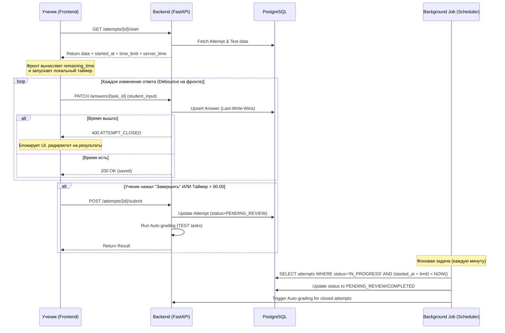
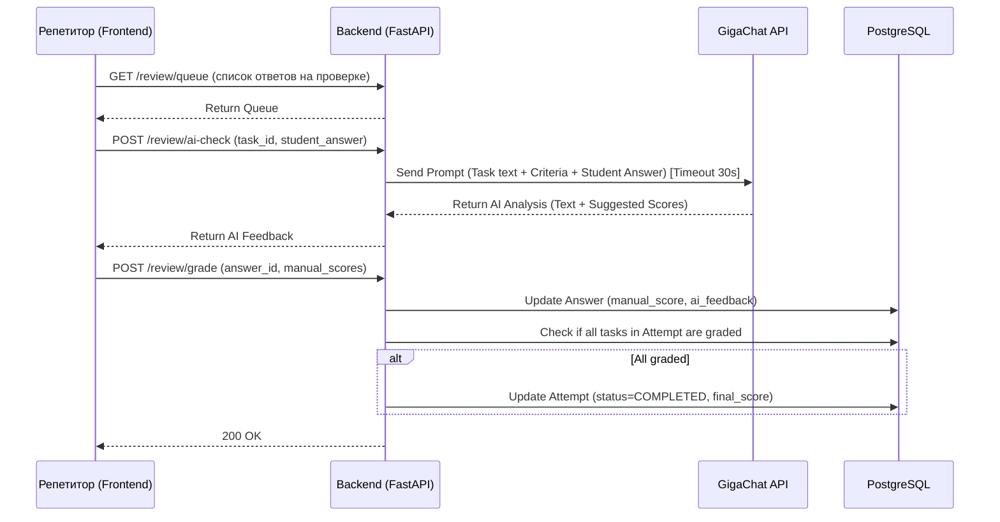

# Архитектура: Комбинатор тестов ФИПИ + Аналитика прогресса (MVP)

> **Правки от 02.07.2026:** обновлён Критический риск №2 (152-ФЗ и несовершеннолетние) — убрано устаревшее требование жёсткой блокировки регистрации / обязательного email родителя для пользователей младше 14 лет. Приведено в соответствие с управленческим решением: возрастных ограничений при регистрации в MVP нет.

### 1. Декомпозиция и Архитектурный стиль

**Выбор: Модульный Монолит (Modular Monolith).**

Мы разделим код на строгие логические модули (домены). Это позволит в будущем (при появлении маркетплейса репетиторов) бесшовно вынести модули в отдельные сервисы без переписывания бизнес-логики.

**Модули (Домены):**

1. **Identity & Access (IAM):** Аутентификация, роли, связи (Репетитор-Ученик-Родитель), согласия на 152-ФЗ.

2. **Content (ФИПИ):** Парсер, хранение предметов, тем (дерево кодификатора), банка заданий.

3. **Examination (Экзамен):** Конструктор тестов, назначения, движок прохождения (Attempt), автосохранение, автопроверка тестовой части.

4. **Review & AI (Проверка):** Очередь на проверку, интеграция с GigaChat, ручное выставление баллов.

5. **Analytics (Аналитика):** Агрегация данных для дашбордов (динамика, слабые темы).

**Технологический стек:**

* **Backend:** Python (FastAPI). *Обоснование:* Отличная работа с текстом/парсингом, нативная поддержка async (важно для ожидания ответов GigaChat), автоматическая генерация OpenAPI (Swagger) для строгих контрактов.

* **Frontend:** Next.js (React). *Обоснование:* SSR для SEO (если потребуется в будущем), отличный State Management для сложного UI прохождения теста и автосохранения.

* **Database:** PostgreSQL. *Обоснование:* Реляционная модель, поддержка JSONB (для гибкого хранения текстов заданий и критериев ФИПИ), транзакционность.

* **Cache & Queue:** Redis (кэш, сессии) + Celery / RabbitMQ (фоновые задачи: парсинг ФИПИ, генерация PDF, мониторинг и закрытие просроченных попыток). **Важно:** запросы к GigaChat в MVP выполняются синхронно, через очередь НЕ идут.

* **AI:** GigaChat API (REST).

* **Infra:** Docker, развертывание в Yandex Cloud или Selectel (обязательное требование 152-ФЗ — хранение ПДн на серверах в РФ).

---

### 2. Модель данных (с заделом на мультитенантность)

Я скорректировал черновик из БТ. Таблица `Connection` была плохой практикой (нарушение нормализации), я разбил её. Добавил `tenant_id` для будущей мультитенантности. Добавлены таблицы для назначений и кодов приглашений.

```sql

-- ЯДРО И БЕЗОПАСНОСТЬ

CREATE TABLE tenants (

id UUID PRIMARY KEY,

name VARCHAR(255),

created_at TIMESTAMP

);

CREATE TABLE users (

id UUID PRIMARY KEY,

tenant_id UUID REFERENCES tenants(id), -- Задел на мультитенантность

email VARCHAR(255) UNIQUE,

password_hash VARCHAR(255), -- Алгоритм: bcrypt или argon2

role VARCHAR(50), -- TUTOR, STUDENT, PARENT

created_at TIMESTAMP

);

CREATE TABLE profiles (

user_id UUID PRIMARY KEY REFERENCES users(id),

first_name VARCHAR(100),

last_name VARCHAR(100),

birth_date DATE,

consent_152fz_at TIMESTAMP, -- Факт и время согласия на обработку ПДн

consent_parent_at TIMESTAMP -- Согласие родителя (если ученик < 18 лет). Зарезервировано для пост-MVP.

);

CREATE TABLE tutor_student (

tutor_id UUID REFERENCES users(id),

student_id UUID REFERENCES users(id),

PRIMARY KEY (tutor_id, student_id)

);

-- ЗАДЕЛ НА БУДУЩЕЕ: Родительский дашборд. В MVP API для родителя не реализуется,

-- но таблица создаётся для сохранения возможности добавления в следующих итерациях.

CREATE TABLE student_parent (

student_id UUID REFERENCES users(id),

parent_id UUID REFERENCES users(id),

PRIMARY KEY (student_id, parent_id)

);

-- ДОБАВЛЕНО: Коды приглашения (для онбординга учеников)

CREATE TABLE invitation_codes (

code VARCHAR(50) PRIMARY KEY,

tutor_id UUID REFERENCES users(id),

expires_at TIMESTAMP NOT NULL,

used_at TIMESTAMP,

used_by_student_id UUID REFERENCES users(id),

UNIQUE(tutor_id, code)

);

-- КОНТЕНТ (ФИПИ)

CREATE TABLE subjects (

id UUID PRIMARY KEY,

tenant_id UUID,

name VARCHAR(100) -- История, Обществознание

);

CREATE TABLE themes (

id UUID PRIMARY KEY,

subject_id UUID REFERENCES subjects(id),

parent_theme_id UUID REFERENCES themes(id), -- Иерархия

fipi_code VARCHAR(50),

name VARCHAR(255)

);

CREATE TABLE tasks (

id UUID PRIMARY KEY,

subject_id UUID,

theme_id UUID,

type VARCHAR(50), -- TEST (краткий), ESSAY (развернутый)

text_content JSONB, -- Текст, варианты ответов, изображения (хранятся как URL на S3)

correct_answer_key JSONB, -- Ключи для автопроверки

fipi_criteria JSONB, -- Критерии оценивания для развернутых

source_url VARCHAR(500)

);

-- Пример структуры text_content:

-- {

-- "text": "Укажите...",

-- "images": ["https://s3.../img1.jpg", "https://s3.../img2.jpg"],

-- "options": ["Вариант 1", "Вариант 2"] -- для TEST-заданий

-- }

-- Пример структуры correct_answer_key:

-- { "type": "single_choice", "value": "2" }

-- { "type": "multiple_choice", "values": ["1", "3", "5"] }

-- { "type": "match", "pairs": [["А","2"], ["Б","1"]] }

-- Пример структуры fipi_criteria:

-- [

-- {"id": "criterion_1", "name": "Названа причина", "max_score": 1},

-- {"id": "criterion_2", "name": "Приведён пример", "max_score": 2}

-- ]

-- ЭКЗАМЕНАЦИОННЫЙ ДВИЖОК

CREATE TABLE tests (

id UUID PRIMARY KEY,

tenant_id UUID,

tutor_id UUID REFERENCES users(id),

title VARCHAR(255),

time_limit_minutes INT NULLABLE, -- NULLABLE: если null, таймер не отображается

created_at TIMESTAMP

);

CREATE TABLE test_tasks (

test_id UUID REFERENCES tests(id),

task_id UUID REFERENCES tasks(id),

order_number INT,

PRIMARY KEY (test_id, task_id)

);

-- ДОБАВЛЕНО: Назначения тестов ученикам

-- ВАЖНО: Статус обновляется при первом старте попытки (IN_PROGRESS) и при завершении

-- последней попытки (COMPLETED). Для ретестов создаются новые записи в attempts,

-- но test_assignments остаётся COMPLETED после первой сдачи.

CREATE TABLE test_assignments (

id UUID PRIMARY KEY,

test_id UUID REFERENCES tests(id),

student_id UUID REFERENCES users(id),

assigned_at TIMESTAMP DEFAULT NOW(),

status VARCHAR(50) DEFAULT 'ASSIGNED' -- ASSIGNED, IN_PROGRESS, COMPLETED

);

CREATE TABLE attempts (

id UUID PRIMARY KEY,

test_id UUID REFERENCES tests(id),

student_id UUID REFERENCES users(id),

started_at TIMESTAMP,

finished_at TIMESTAMP,

status VARCHAR(50), -- IN_PROGRESS, PENDING_REVIEW, COMPLETED

auto_score INT -- Сумма баллов за тестовую часть

);

CREATE TABLE answers (

id UUID PRIMARY KEY,

attempt_id UUID REFERENCES attempts(id),

task_id UUID REFERENCES tasks(id),

student_input TEXT,

auto_score INT,

manual_score INT,

ai_feedback TEXT,

updated_at TIMESTAMP

);

```

---

### 3. API Контракты (Строгие схемы)

Все API строится по принципу REST, форматы — JSON. Ниже приведены критически важные контракты.

#### 3.1. Сохранение черновика ответа (Автосохранение)

*Эндпоинт:* `PATCH /api/v1/attempts/{attempt_id}/answers/{task_id}`

*Request:*

```json

{

"student_input": "Причины отмены крепостного права: 1. Экономическая..."

}

```

*Response (200 OK):*

```json

{

"status": "saved",

"updated_at": "2023-10-27T10:00:00Z"

}

```

*Error (400):*

```json

{

"error_code": "ATTEMPT_CLOSED",

"message": "Время теста истекло. Результаты фиксируются."

}

```

*Примечание:* Используется стратегия **Last-Write-Wins**. Клиентский timestamp не передается, бэкенд фиксирует время сохранения. Если статус попытки уже закрыт или время вышло — возвращается `400 ATTEMPT_CLOSED` без триггера сдачи (сдачу инициирует фронт или фоновая задача).

#### 3.2. Запрос AI-подсказки для проверки

*Эндпоинт:* `POST /api/v1/review/ai-check`

*Request:*

```json

{

"task_id": "uuid-task-123",

"student_answer": "Текст ответа ученика..."

}

```

*Response (200 OK):*

```json

{

"ai_feedback": "Ученик верно назвал причину 1, но упустил причину 2. Критерий 2 не выполнен.",

"suggested_scores": {

"criterion_1": 1,

"criterion_2": 0

}

}

```

*Примечание:* Для MVP запрос выполняется **синхронно**. Бэкенд настраивает HTTP-клиент к GigaChat с `timeout=30s`. Фронтенд отображает лоадер на время запроса. Асинхронная очередь с rate-limiting отложена на пост-MVP.

#### 3.3. Сдача теста и автопроверка

*Эндпоинт:* `POST /api/v1/attempts/{attempt_id}/submit`

*Response (200 OK):*

```json

{

"attempt_id": "uuid",

"status": "PENDING_REVIEW",

"auto_score": 15,

"max_auto_score": 20,

"pending_essay_count": 3

}

```

*Примечание:* Автопроверка TEST-заданий выполняется синхронно в рамках запроса. Если время обработки превышает 5 сек, рассмотреть перенос в фоновую задачу с поллингом статуса.

#### 3.4. Получение состояния попытки (для синхронизации таймера)

*Эндпоинт:* `GET /api/v1/attempts/{attempt_id}`

*Response (200 OK):*

```json

{

"attempt_id": "uuid",

"status": "IN_PROGRESS",

"started_at": "2023-10-27T10:00:00Z",

"time_limit_minutes": 60,

"server_time": "2023-10-27T10:05:12Z"

}

```

*Примечание:* Фронтенд вычисляет `remaining_seconds = (started_at + time_limit_minutes) - server_time` и тикает локально. Если `time_limit_minutes = null`, фронтенд не отображает таймер.

#### 3.5. Получение списка заданий теста

*Эндпоинт:* `GET /api/v1/attempts/{attempt_id}/tasks`

*Response (200 OK):*

```json

{

"attempt_id": "uuid",

"tasks": [

{

"task_id": "uuid-task-1",

"order_number": 1,

"type": "TEST",

"text_content": { "text": "...", "images": [...], "options": [...] }

}

]

}

```

#### 3.6. Регистрация пользователя

*Эндпоинт:* `POST /api/v1/auth/register`

*Request:*

```json

{

"email": "student@example.com",

"password": "securePassword123",

"first_name": "Иван",

"last_name": "Петров",

"birth_date": "2008-05-15",

"role": "STUDENT",

"invitation_code": "ABC123"

}

```

*Response (201 Created):*

```json

{

"user_id": "uuid",

"email": "student@example.com",

"role": "STUDENT",

"access_token": "jwt-token",

"refresh_token": "refresh-token"

}

```

*Примечание:* Регистрация доступна всем пользователям независимо от возраста. Дата рождения сохраняется для статистики, но не влияет на доступ к функционалу.

#### 3.7. Аутентификация

*Эндпоинт:* `POST /api/v1/auth/login`

*Request:*

```json

{

"email": "student@example.com",

"password": "securePassword123"

}

```

*Response (200 OK):*

```json

{

"user_id": "uuid",

"access_token": "jwt-token",

"refresh_token": "refresh-token"

}

```

*Error (401):* `{ "error_code": "INVALID_CREDENTIALS", "message": "Неверный email или пароль" }`

#### 3.8. Получение дерева тем (для конструктора тестов)

*Эндпоинт:* `GET /api/v1/themes/tree?subject_id={subject_id}`

*Response (200 OK):*

```json

{

"subject_id": "uuid",

"themes": [

{

"id": "uuid-theme-1",

"name": "Древний мир",

"fipi_code": "1",

"children": [

{

"id": "uuid-theme-2",

"name": "Первобытное общество",

"fipi_code": "1.1",

"children": []

}

]

}

]

}

```

#### 3.9. Создание теста

*Эндпоинт:* `POST /api/v1/tests`

*Request:*

```json

{

"title": "Диагностический тест по истории",

"time_limit_minutes": 60,

"tasks": [

{ "task_id": "uuid-task-1", "order_number": 1 },

{ "task_id": "uuid-task-2", "order_number": 2 }

]

}

```

*Response (201 Created):*

```json

{

"test_id": "uuid",

"title": "Диагностический тест по истории",

"time_limit_minutes": 60,

"created_at": "2023-10-27T10:00:00Z"

}

```

#### 3.10. Назначение теста ученикам

*Эндпоинт:* `POST /api/v1/tests/{test_id}/assign`

*Request:*

```json

{

"student_ids": ["uuid-student-1", "uuid-student-2"]

}

```

*Response (200 OK):*

```json

{

"assignments": [

{ "assignment_id": "uuid", "student_id": "uuid-student-1", "status": "ASSIGNED" },

{ "assignment_id": "uuid", "student_id": "uuid-student-2", "status": "ASSIGNED" }

]

}

```

*Примечание:* При вызове эндпоинта бэкенд создаёт записи в таблице `test_assignments` для каждого `student_id` со статусом `ASSIGNED`.

#### 3.11. Ручная проверка ESSAY-задания

*Эндпоинт:* `POST /api/v1/review/grade`

*Request:*

```json

{

"answer_id": "uuid-answer-1",

"scores": {

"criterion_1": 1,

"criterion_2": 2

},

"comment": "Ответ полный, но есть фактическая ошибка в дате."

}

```

*Response (200 OK):*

```json

{

"answer_id": "uuid-answer-1",

"manual_score": 3,

"status": "GRADED",

"attempt_status": "PENDING_REVIEW"

}

```

*Примечание:* Если все ESSAY-задания в попытке проверены, бэкенд автоматически меняет статус попытки на `COMPLETED` и выставляет итоговый балл.

#### 3.12. Дашборд аналитики

*Эндпоинт:* `GET /api/v1/analytics/dashboard?student_id={student_id}`

*Response (200 OK):*

```json

{

"student_id": "uuid",

"total_tests": 15,

"average_score": 78.5,

"dynamics": [

{ "date": "2023-10-01", "score": 65 },

{ "date": "2023-10-15", "score": 72 },

{ "date": "2023-10-27", "score": 85 }

],

"weak_themes": [

{ "theme_id": "uuid", "name": "Реформы Петра I", "success_rate": 45.0 }

],

"strong_themes": [

{ "theme_id": "uuid", "name": "Великая Отечественная война", "success_rate": 92.0 }

]

}

```

*Примечание:* Для ESSAY-заданий используется нормализованный балл (`manual_score / max_score`). В аналитике учитываются ВСЕ попытки прохождения (ретесты).

#### 3.13. Генерация кода приглашения

*Эндпоинт:* `POST /api/v1/invitation-codes`

*Request:*

```json

{

"expires_in_days": 7

}

```

*Response (201 Created):*

```json

{

"code": "ABC123",

"expires_at": "2023-11-03T10:00:00Z"

}

```

---

### 4. Сценарии (Sequence Diagrams)

#### Сценарий 1: Прохождение теста и автосохранение (US-6)



#### Сценарий 2: Проверка развернутого ответа с AI (US-3)



---

### 5. Риски и Непокрытые требования

Как архитектор, я обязан подсветить "слепые зоны", которые могут убить проект на этапе реализации:

#### 🔴 Критические риски:

1. **Парсинг ФИПИ (Блокер US-1):** Открытый банк ФИПИ не имеет публичного API. Парсинг HTML-страниц крайне хрупок.

* *Митигация:* Заложить в спринт 1 написание парсера и его "заморозку". Если ФИПИ изменит верстку или введет Cloudflare/Captcha, MVP встанет. *Решение:* Рассмотреть возможность ручного импорта заданий репетитором в UI на старте, пока парсер не будет стабилизирован.

2. **152-ФЗ и несовершеннолетние (снято управленческим решением):** По закону, согласие на обработку ПДн за ребенка до 14 лет по-хорошему должны давать родители, от 14 до 18 — ребенок с согласия родителя. **Управленческое решение: в MVP (закрытый прототип) жёсткая верификация возраста и блокировка/требование email родителя при регистрации НЕ реализуются.** Любой пользователь регистрируется самостоятельно, дата рождения сохраняется только для статистики и не влияет на доступ к функционалу.

* *Остаточный риск:* формально это не полностью закрывает требование закона о согласии родителя за детей до 14 лет. Митигация — юридически корректные тексты оферты и чекбокс согласия при регистрации (без верификации возраста). Полноценная верификация — вопрос для юриста и пост-MVP.

3. **Галлюцинации GigaChat (Риск US-3):** AI может ошибочно оценить ответ.

* *Митигация:* В UI жестко закрепить, что AI-подсказка — это *черновик*. Репетитор не может просто нажать "Скопировать оценку AI", он обязан вручную кликнуть по каждому критерию (или хотя бы подтвердить).

#### 🟡 Непокрытые требования (Требуют уточнения у Аналитика/Бизнеса):

1. **Конфликт версий при автосохранении:** *Решено на уровне архитектуры.* Используется стратегия **Last-Write-Wins**. Если ученик пишет ответ на телефоне без интернета, а потом зашел с ПК, побеждает последняя сохраненная на сервере версия. Фронтенд хранит черновики локально в IndexedDB и синхронизирует их при появлении связи.

2. **Сброс таймера:** *Решено на уровне архитектуры.* Таймер ведется **гибридно**. Бэкенд отдает `started_at`, `time_limit` и `server_time`. Фронтенд тикает локально для UX. При отправке ответа или сабмите бэкенд строго валидирует время по своим часам. Если время вышло, бэкенд возвращает `400 ATTEMPT_CLOSED`.

3. **Групповые назначения (US-2):** В критериях сказано "ученику или группе". В модели данных это реализовано через массив `student_ids` при создании записей в `test_assignments`. Сущность `Group` для MVP не создается (избыточна).

4. **Лимиты GigaChat:** У GigaChat есть лимиты запросов в минуту (RPM).

* *Решение для MVP:* Запросы к AI выполняются **синхронно** с жестким HTTP-таймаутом (30 сек). Если репетитор массово проверяет тесты, фронтенд будет показывать лоадер. Перенос в асинхронную очередь (Celery) с rate-limiting отложен на пост-MVP, если упремся в лимиты API на практике.

5. **Роль «Родитель» в MVP:** *Решено на уровне архитектуры.* Таблица `student_parent` создаётся как задел на будущее, но API для родителя (`GET /analytics/child/{id}`) в MVP не реализуется. Родительский дашборд переносится в следующую итерацию.

6. **Связь test_assignments ↔ attempts:** *Решено на уровне архитектуры.* Статус `test_assignments` обновляется при первом старте попытки (IN_PROGRESS) и при завершении последней попытки (COMPLETED). Для ретестов создаются новые записи в `attempts`, но `test_assignments` остаётся COMPLETED после первой сдачи.
